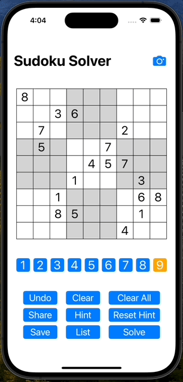
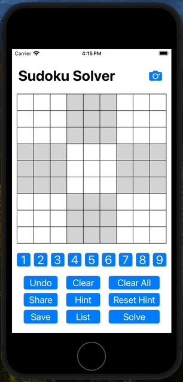
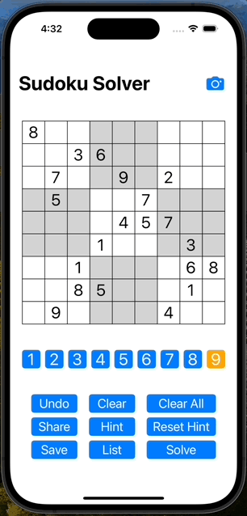

# 数独ソルバー

## 使い方
### 手入力の場合
1. 1 ~ 9の数字ボタンのうち、盤面に入力したいボタンを選択します。 
2. 解きたい数独を盤面に入力します。 
3. 入力が完了したら、「Solve」ボタンを押します。 
適切に処理が完了すると、解が表示されます。 
 

### 写真から読み込む場合
注意：写真からの読み込み機能は、開発中です。 
現時点では、iPhone SEでしか正常に読み込みできません。 
画像からの文字認識には、[Vision Framework](https://developer.apple.com/documentation/vision/)を使用しています。 
機械学習モデルには、MNISTClassifierを用いています。 
MNISTClassifierのCore MLモデルは[こちら](https://developer.apple.com/jp/machine-learning/models/)からダウンロードできます。 

1. 右上のカメラボタンを押します。 
2. 画面が変わったら、「Photo Library」ボタンを押します。 
3. 解きたい数独の画像を選択します。 
4. 「Load Sudoku」ボタンを押します。 
5. 適切に処理が完了すれば、盤面の画面に戻り、画像から数独が読み込まれています。 
6. 「Solve」ボタンを押します。 適切に処理が完了すると、解が表示されます。 
 

### 数独の保存
1. 「Save」ボタンを押すと、現在の盤面がリストに保存されます。 
（「Clear All」ボタンで全ての数字を消すことができます。） 
2. 「List」ボタンで保存した数独を表示し、読み込むことができます。 
 

### ヒントの表示
数独を全て解くのではなくて、ある特定のマスだけヒントが欲しい時は、「Hint」ボタンが使えます。
1. 「Hint」ボタンを押して、ヒントが欲しいマスをタップします。 タップされたマスはオレンジ色になります。 
2. 「Solve」ボタンを押します。 適切に処理が完了すると、オレンジ色のマスのみ、解が表示されます。 
 